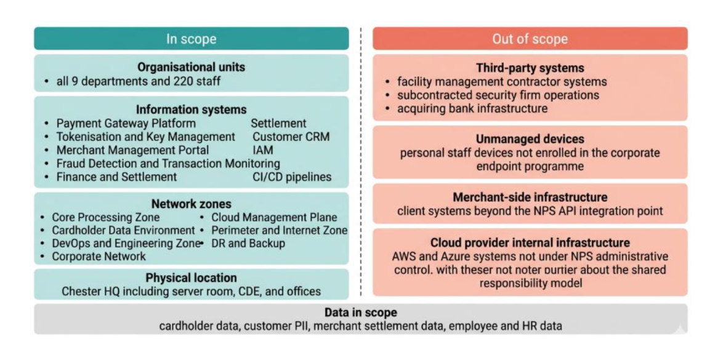
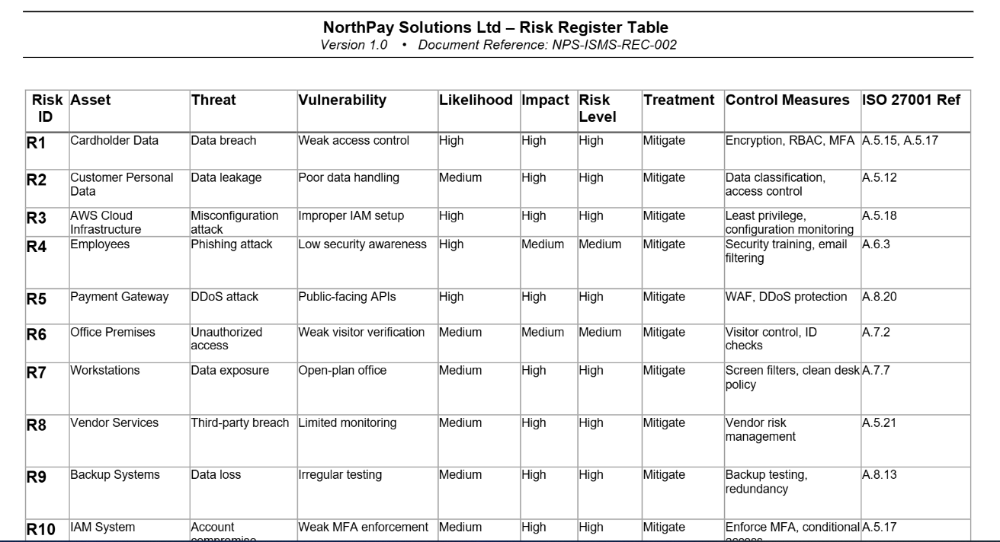
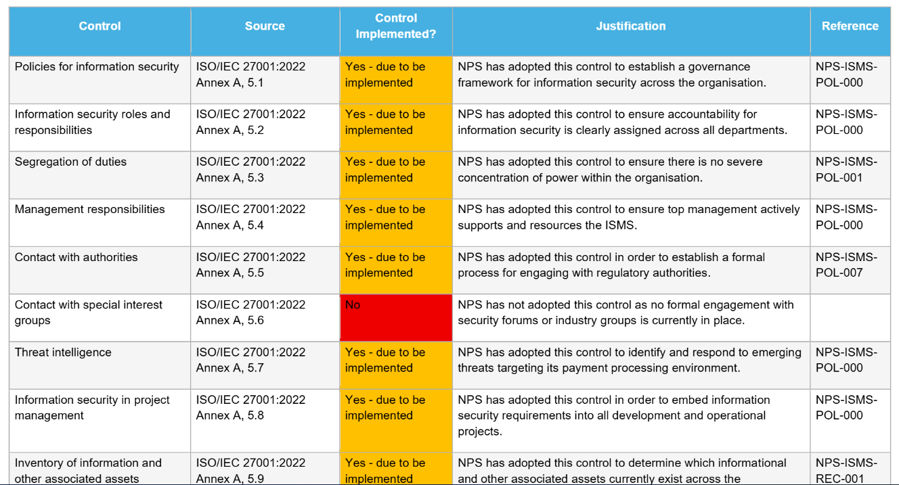
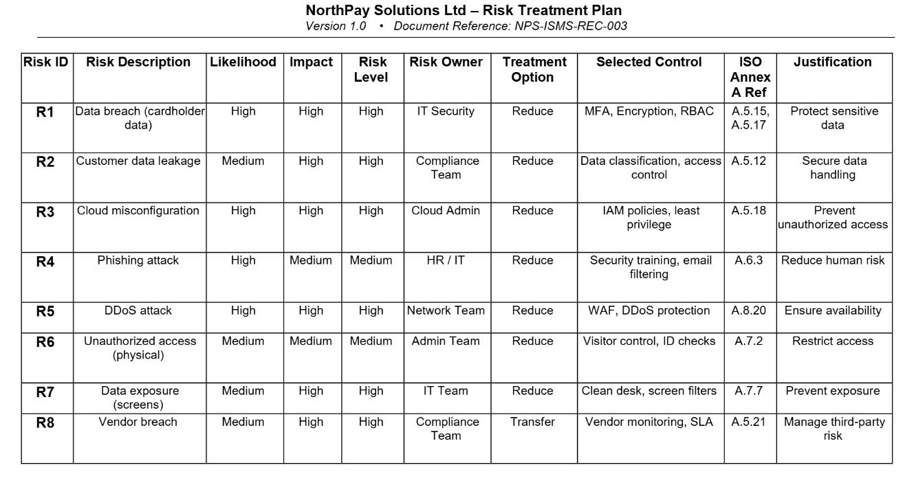

# 🛡️ ISO/IEC 27001:2022 Information Security Management System (ISMS)

> A complete Information Security Management System (ISMS) implementation for a fictional UK-based fintech organization, developed in alignment with ISO/IEC 27001:2022 and industry best practices.

---

## 📖 Project Overview

This repository presents the design and implementation of an Information Security Management System (ISMS) for **NorthPay Solutions Ltd (NPS)**, a fictional fintech company operating in the UK payment processing sector.

The project demonstrates the practical application of ISO/IEC 27001:2022 by establishing an information security governance framework, identifying and assessing organizational risks, selecting and justifying security controls, developing supporting policies, and creating a structured roadmap for implementation and continual improvement.

The implementation follows internationally recognized standards and frameworks, including:

- ISO/IEC 27001:2022
- ISO/IEC 27005
- NIST SP 800-30
- PCI DSS v4.0
- UK GDPR
- Plan-Do-Check-Act (PDCA)

---

# 🎯 Project Objectives

This project was designed to:

- Define the scope and boundaries of an ISMS
- Identify organizational stakeholders and security responsibilities
- Perform internal and external context analysis
- Conduct an asset-based information security risk assessment
- Develop a Risk Register and Risk Treatment Plan
- Produce a Statement of Applicability (SoA)
- Develop supporting Information Security Policies
- Create an ISO 27001 implementation roadmap
- Demonstrate continual improvement using the PDCA model

---

# 📂 Repository Structure

```text
ISO27001-ISMS-Implementation
│
├── README.md
├── docs/
│   └── ISMS_Report.pdf
│
├── assets/
│   ├── Scope-Diagram.png
│   ├── Risk-Matrix.png
│   ├── PDCA-Cycle.png
│   └── Implementation-Roadmap.png
│
├── policies/
│
├── risk-management/
│
└── references/
```

---

# 📌 Key Deliverables

✔ Information Security Management System (ISMS)

✔ Scope Statement

✔ Stakeholder Analysis

✔ Context Analysis

✔ Asset Inventory

✔ Risk Register

✔ Risk Treatment Plan

✔ Statement of Applicability (SoA)

✔ Information Security Policy

✔ Security Policies and Procedures

✔ ISO Annex A Control Mapping

✔ Implementation Roadmap

---

# 🛠 Skills Demonstrated

- Governance, Risk & Compliance (GRC)
- Information Security Governance
- ISO/IEC 27001 Implementation
- ISO 27005 Risk Assessment
- Asset Identification & Classification
- Risk Analysis & Treatment
- Statement of Applicability (SoA)
- Security Policy Development
- ISO Annex A Control Mapping
- PCI DSS Compliance
- UK GDPR Compliance
- Security Documentation
- Continuous Improvement (PDCA)

---

# 📚 Standards & Frameworks

| Standard | Purpose |
|----------|---------|
| ISO/IEC 27001:2022 | Information Security Management System |
| ISO/IEC 27005 | Information Security Risk Management |
| NIST SP 800-30 | Risk Assessment Methodology |
| PCI DSS v4.0 | Payment Card Security Controls |
| UK GDPR | Data Protection & Privacy |
| PDCA | Continual Improvement Model |

---

# 📄 Project Report

The complete ISMS project report is available in:

```
docs/ISMS_Report.pdf
```

---

# 🚀 Future Improvements

Future enhancements for this project include:

- Business Continuity Plan (BCP)
- Disaster Recovery Plan (DRP)
- Internal Audit Programme
- Security Metrics Dashboard
- Supplier Risk Assessment Framework
- ISO 27001 Internal Audit Checklist
- Compliance Monitoring Dashboard

---

# ⚠️ Disclaimer

This repository was developed for **educational and professional portfolio purposes**.

NorthPay Solutions Ltd (NPS) is a fictional organization created as part of an academic cybersecurity project. No confidential, proprietary, or production data is contained within this repository.

---

# 👨‍💻 Author

## Bonaventure Ezinwa

**Governance, Risk & Compliance (GRC) Analyst**

Passionate about Governance, Risk Management, Compliance, ISO 27001 implementation, cybersecurity governance, and information security risk management.

### Connect with Me

- **GitHub:** https://github.com/starbona
- **LinkedIn:** https://www.linkedin.com/in/BONAVENTURE EZINWA

---

## Project Preview

### ISMS Scope



---

### Risk Register



---

### Statement of Applicability



---

### Implementation Roadmap


